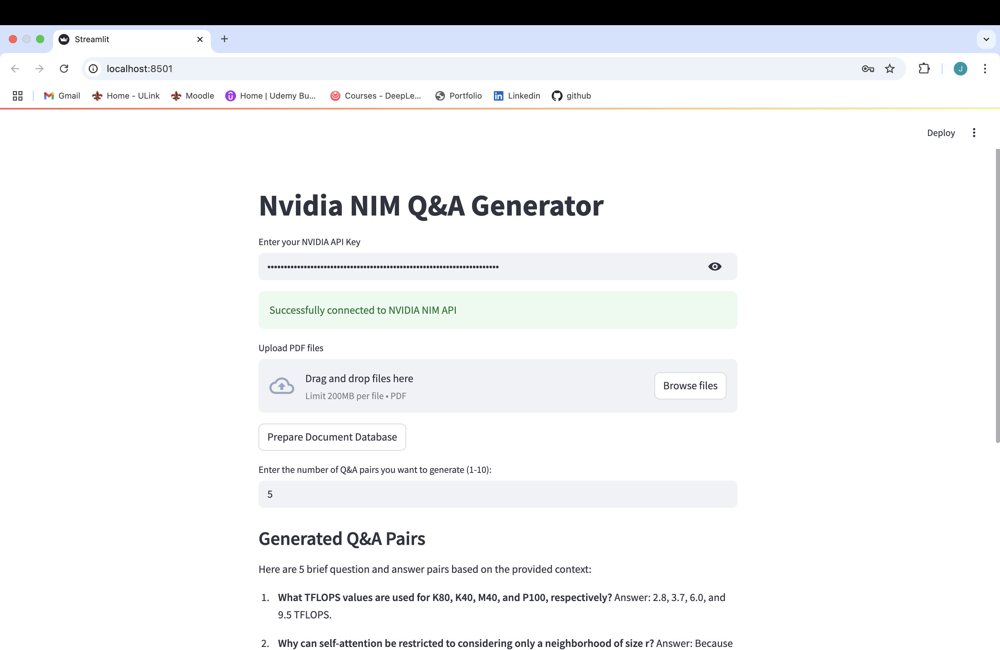

<div align="center">

# NVIDIA NIM Q&A Generator

[](https://www.python.org/)
[](https://streamlit.io/)
[](https://python.langchain.com/)
[](https://www.nvidia.com/en-us/ai-data-science/products/nim/)
[](https://www.gnu.org/licenses/gpl-3.0)


</div>

## 📋 Overview

The NVIDIA NIM Q&A Generator is a powerful application that leverages NVIDIA's NIM (NVIDIA Inference Microservices) and LLaMa 3 70B model to generate question and answer pairs from PDF documents. This tool allows users to upload PDF files, process them using advanced NLP techniques, and generate comprehensive Q&A pairs based on the document content.

## Landing Page



## ✨ Features

- **PDF Document Processing**: Upload and process multiple PDF documents
- **Vector Database Creation**: Automatically creates embeddings and vector stores for efficient retrieval
- **Q&A Generation**: Generate multiple question and answer pairs based on document content
- **NVIDIA NIM Integration**: Utilizes NVIDIA's powerful AI models for high-quality responses
- **Interactive UI**: User-friendly Streamlit interface for easy interaction

## 🔧 Technical Architecture

- **Frontend**: Streamlit for the user interface
- **Embeddings**: NVIDIA AI Embeddings for vector representation
- **LLM**: Meta's LLaMa 3 70B model via NVIDIA NIM
- **Vector Store**: FAISS for efficient similarity search
- **Document Processing**: LangChain's document loaders and text splitters

## 🚀 Installation

### Prerequisites

- Python 3.8 or higher
- NVIDIA API Key (starts with 'nvapi')

### Setup

1. Clone the repository:
   ```bash
   git clone
   ```

2. Install dependencies:
   ```bash
   pip install -r requirements.txt
   ```

## 💻 Usage

1. Start the Streamlit application:
   ```bash
   streamlit run nvidia_nim.py
   ```

2. Enter your NVIDIA API Key when prompted

3. Upload PDF documents or use the default documents in the `temp` directory

4. Click "Prepare Document Database" to process the documents

5. Enter the number of Q&A pairs you want to generate

6. View the generated Q&A pairs and the source documents

## 🔑 API Key

To use this application, you need a valid NVIDIA API Key that starts with 'nvapi'. You can obtain one by:

1. Visiting the [NVIDIA Developer Portal](https://developer.nvidia.com/)
2. Creating or logging into your NVIDIA account
3. Navigating to the API section and generating a new API key

## 📊 How It Works

1. **Document Processing**: PDF documents are loaded and split into manageable chunks
2. **Embedding Creation**: Document chunks are converted into vector embeddings using NVIDIA's embedding model
3. **Vector Database**: Embeddings are stored in a FAISS vector database for efficient retrieval
4. **Query Processing**: User queries are processed to retrieve relevant document chunks
5. **Response Generation**: The LLaMa 3 70B model generates Q&A pairs based on the retrieved chunks

## 🤝 Contributing

Contributions are welcome! Please feel free to submit a Pull Request.

## 📄 License

This project is licensed under the GNU General Public License (GPL) - see the LICENSE file for details.
